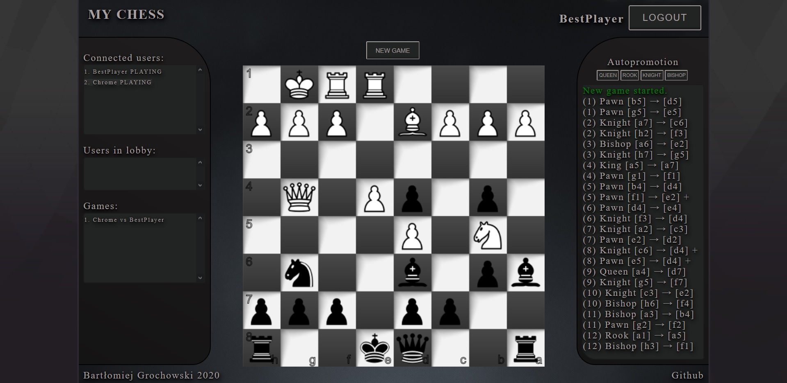

# My Chess

<p align="center">
  
</p>

This is my custom chess portal. Users can play chess each other online. No account required - just type your nick, invite another player to connect and start a new game!

Try it yourself on: https://my-chess-ketrab.herokuapp.com/

## How it works?
At least two players must be online to start a new game. If one player requests the new game, it is moved to 'Users in lobby' list. When second player is in lobby, they will start to play.

Game is managed by the server. Players only send requests which move they want to make and server counts if it is possible or does it cause an event (check, checkmate, ...). In case of forbidden move, server sends an error message and asks player for another, correct move. If the move is proper, the server updates chessboard and ask another player for its move.

Server stores information about connected users and recognize them using cookie-based authentication. If user reconnect, socket.io admits different socket id - it is updated and stored in class 'OnlinePlayer'. See file server/servermanager.js for more details.

## Game
A 'Game' object stores information about state of concrete game (board, list of moves and all chessmen objects). Server manager handle events and redirect requests to concrete game. There it is calculated if requested move is correct and if it causes any event. (Details in file server/game.js)

## Chessmen
File server/chessmen.js stores information about classes: Pawn, Bishop, Knight, Rook, Queen, King. Each class implements method 'canMove'. This method determine if move from [self.col,self.row] to [newCol,newRow] is proper or not.

## Database & authentication
Database module provides storing information in external database like MSSQL, PostreSQL, ... . Note, that it is not implemented on heroku app, because it is not free. However in the Github code you can read ready an implementation and easly run it offline. You have to create configuration file: MyChess/config.json.

Example:
```json
{
    "cookieParser": {
        "secret": "foobarbaz12345"
    },
    "MSSQL": {
        "user": "user1",
        "password": "password123",
        "server": "localhost", 
        "database": "CHESS_DATABASE"
    },
    "membership": {
        "iterations": 1000,
        "keylen": 32,
        "digest": "sha256",
        "encoding": "base64",
        "salt": "7625eBB24dc0f0EC91aD"
    }
}
```

Afterwards you need to set database mode in main function (server/app.js):
```js
await dbManager.connectToDatabase(dbManager.mode.MSSQL); // connect with MSSQL server
```

Authentication is working on hashing password using pbkdf2 and comparing with hash storing in database (see server/membership.js for the details).